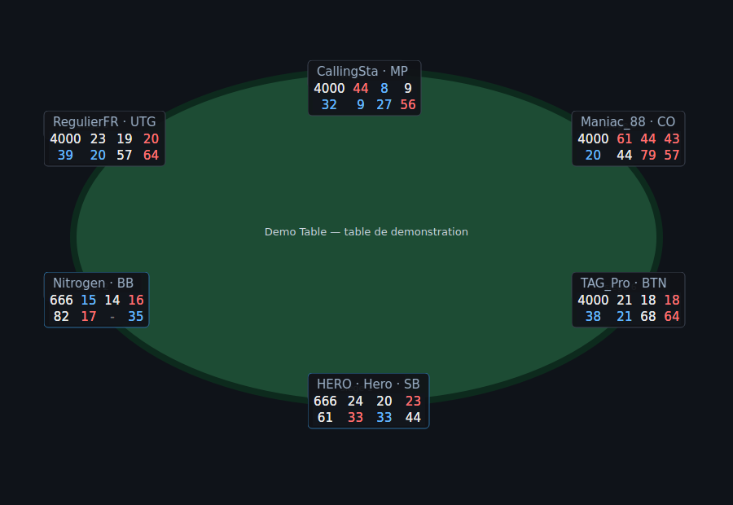
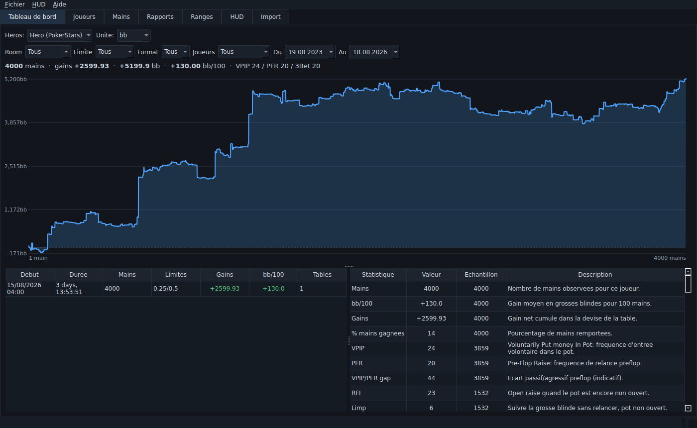
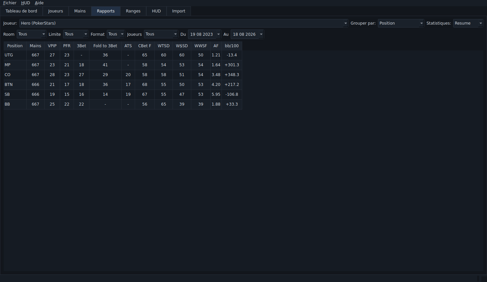
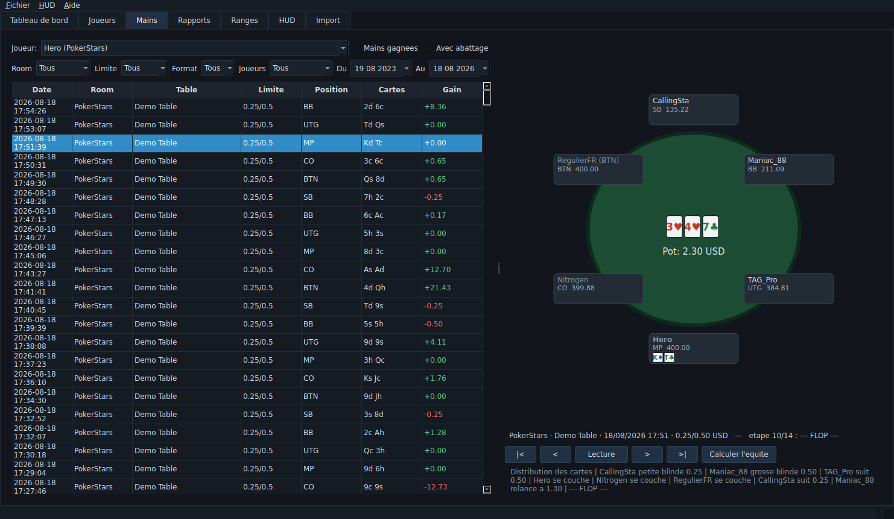
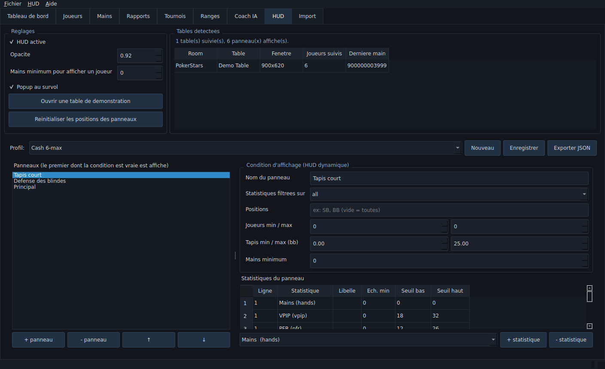
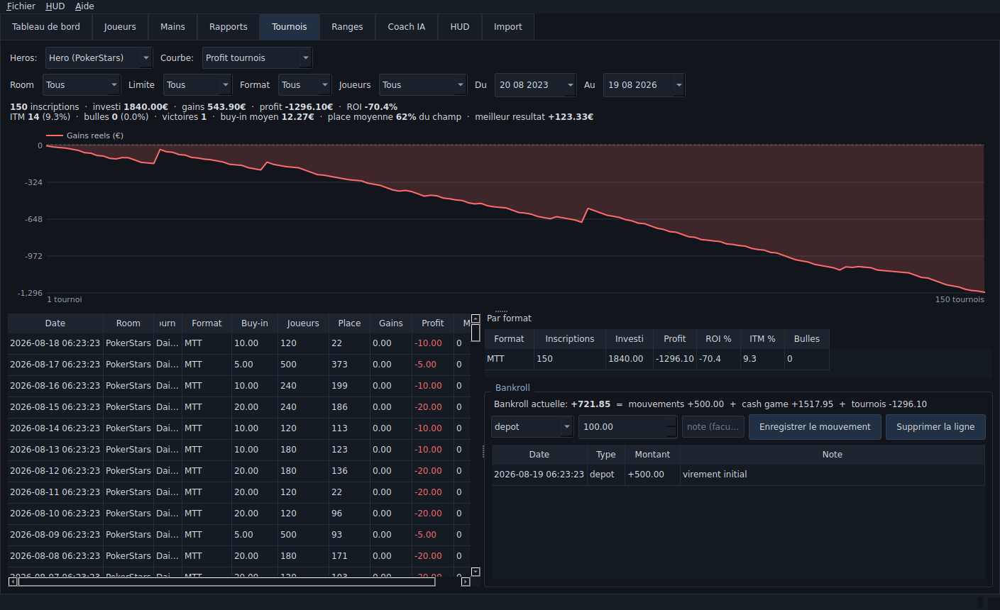
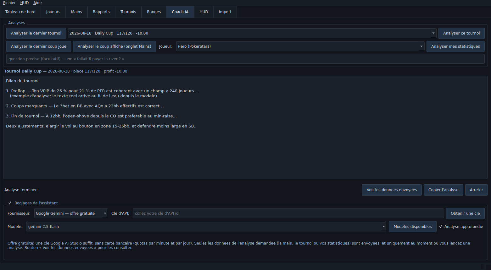

# PokerTracker

Logiciel de suivi de mains, de statistiques et de **HUD temps reel** pour le
poker en ligne, compatible **Windows 11**, ecrit en Python + Qt (PySide6).
Il reprend le fonctionnement d'un tracker moderne de type Hand2Note 4.1 :
import automatique des historiques, base de mains, HUD dynamique superpose
aux tables, popups detailles, replayer, rapports et travail sur les ranges.



*Le HUD sur une table : chaque joueur a son panneau, et les joueurs aux
blindes (ici Nitrogen et Hero) affichent automatiquement le panneau
« Defense des blindes » avec des statistiques filtrees sur leur position —
d'ou l'echantillon reduit (666 mains contre 4000).*

---

## Ce que fait le logiciel

| Domaine | Fonctionnalites |
|---|---|
| **Import** | Detection automatique des dossiers d'historiques, import initial massif, **import incremental temps reel** pendant la session (une main a peine ecrite par la room est lue en moins d'une seconde), gestion des mains encore en cours d'ecriture, dedoublonnage. |
| **Archivage** | Copie de chaque main importee dans `%APPDATA%\PokerTracker\archive`, rangee par room et par mois. Les rooms purgent leurs dossiers au bout de quelques mois: l'archive permet de tout reimporter, y compris apres reconstruction de la base. |
| **Rooms** | PokerStars (cash, Zoom, MTT/SNG), Winamax (cash, Expresso, MTT), GGPoker/GGNetwork, PartyPoker. Detection du format faite sur le contenu du fichier, pas sur son nom. |
| **Statistiques** | 125 compteurs extraits par main, **59 statistiques** derivees (VPIP, PFR, RFI, 3Bet/4Bet/5Bet, Cold 4Bet, Fold to 3Bet, Squeeze, Steal, Fold vs steal, Resteal, Limp, Iso, C-Bet / Delayed C-Bet / Donk / Probe / Check-raise par street, Fold vs mise, AF, AFq, WWSF, WTSD, W$SD, bb/100...). Voir [docs/statistiques.md](docs/statistiques.md). |
| **HUD** | Panneaux translucides toujours au premier plan, poses sur chaque siege, suivi des fenetres de table, deplacement a la souris memorise, popup detaille au survol ou au clic droit, note de joueur, couleurs conditionnelles, filtre par echantillon minimum. |
| **HUD dynamique** | Plusieurs panneaux par profil, chacun avec sa **condition d'affichage** (position occupee a la main suivante, nombre de joueurs, profondeur de tapis en bb, nombre de mains, format de jeu). Le premier panneau dont la condition est vraie s'affiche : le HUD change tout seul selon la situation. Un panneau peut aussi afficher des stats **filtrees sur la position** du joueur. |
| **Gains ajustes (all-in EV)** | Les mains dont le tapis part avant la riviere sont rejouees mathematiquement: la part du pot due a l'equite remplace le resultat tire au sort. Seconde courbe sur le graphique, statistiques `bb/100 ajuste` et `Chance (bb)`. Enumeration exacte au flop et au turn, Monte-Carlo preflop. |
| **Tournois** | Lecture des resumes de tournoi (PokerStars, Winamax): buy-in, primes, entrants, place, gains. Bilan par periode et par format: inscriptions, ITM, **bulles**, ROI, profit, victoires, place moyenne, buy-in moyen. |
| **Bankroll** | Depots, retraits et ajustements; bankroll = mouvements + resultats cash + resultats tournois, avec courbe d'evolution. |
| **Coach IA (gratuit)** | Analyses en un clic: **dernier tournoi**, **tournoi choisi dans la liste**, **dernier coup joue**, **coup affiche dans le replayer**, **statistiques du joueur**. Fonctionne avec l'offre gratuite de **Google Gemini** (cle AI Studio, sans carte bancaire); Anthropic reste disponible pour qui a deja une cle. Reponse en direct, donnees envoyees consultables. |
| **Argent reel uniquement** | Les tables et tournois en argent fictif sont reconnus (PokerStars, Winamax, GGPoker, PartyPoker) et **exclus par defaut** de toutes les statistiques, rapports, courbes, du HUD et du bilan financier. Une case « Inclure l'argent fictif » permet de les réintégrer ponctuellement. |
| **Replayer** | Rejeu action par action, table dessinee, mises, tapis, board, lecture automatique, **calcul d'equite** a l'etape courante (Monte-Carlo). |
| **Rapports** | Statistiques croisees par position, limite, room, format, table, nombre de joueurs ; graphique de gains cumules (argent ou bb) ; decoupage automatique en sessions. |
| **Joueurs** | Recherche, tableau comparatif, statistiques par position, notes, etiquettes et couleurs reprises dans le HUD. |
| **Ranges** | Grille 13x13 editable, notation texte (`77+, AQs+, A2s-A5s`, `15%`), pourcentage de combinaisons, calculateur d'equite main contre range avec board. |
| **Confort** | Theme sombre, table de demonstration pour regler le HUD sans ouvrir de client de poker, configuration et base rangees dans `%APPDATA%\PokerTracker`. |

### Quelques ecrans

| | |
|---|---|
|  |  |
| Tableau de bord : gains reels et gains ajustes a l'equite | Rapports : statistiques croisees par position |
|  |  |
| Liste des mains et replayer avec calcul d'equite | Editeur de profil HUD et conditions dynamiques |
|  |  |
| Tournois et bankroll: ROI, ITM, bulles, courbe | Coach IA: contexte envoye et analyse |

---

## Installation sur Windows 11

### Solution 1 — executable autonome (recommandee)

```powershell
git clone <ce-depot> PokerTracker
cd PokerTracker
.\packaging\build_windows.ps1
```

Le script cree l'environnement, installe les dependances, lance les tests et
produit `dist\PokerTracker\PokerTracker.exe`. Ce dossier peut etre copie tel
quel sur une machine sans Python. Details : [packaging/README.md](packaging/README.md).

### Solution 2 — depuis les sources

```powershell
python -m venv .venv
.\.venv\Scripts\Activate.ps1
pip install -r requirements.txt
python run.py
```

Python 3.10 ou plus recent est requis (teste avec 3.11).

### Coach IA — cle gratuite

L'onglet Coach IA utilise par defaut **Google Gemini**, dont l'offre gratuite
suffit a l'usage (quotas par minute et par jour, sans carte bancaire) :

1. creer une cle sur <https://aistudio.google.com/apikey> ;
2. la coller dans l'onglet **Coach IA → Reglages de l'assistant** (ou definir
   la variable d'environnement `GEMINI_API_KEY`).

La bibliotheque necessaire (`google-genai`) est installee avec les
dependances. Pour utiliser Claude a la place, `pip install anthropic` puis
choisir « Anthropic Claude » dans la liste des fournisseurs.

**Aucune donnee n'est envoyee tant qu'une analyse n'est pas lancee**, et le
bouton « Voir les donnees envoyees » affiche exactement ce qui part.

---

## Prise en main

1. **Onglet Import → « Detecter automatiquement »**. Les emplacements usuels
   des historiques sont testes :
   - PokerStars : `%LOCALAPPDATA%\PokerStars\HandHistory`
   - Winamax : `%APPDATA%\wamax\documents\accounts`
   - GGPoker : `%APPDATA%\GGPoker\HandHistory`
   - PartyPoker : `Documents\PartyGaming\PartyPoker\HandHistory`

   Sinon, « Ajouter un dossier… ». **Pensez a activer la sauvegarde des
   historiques dans les options de votre room**, sans quoi aucun fichier n'est
   ecrit.
2. **« Importer maintenant »** pour charger l'existant. Un premier import de
   plusieurs centaines de milliers de mains prend quelques minutes ; les
   suivants ne relisent que ce qui a ete ajoute.
3. Laisser **« Import automatique en temps reel »** coche : c'est ce qui
   alimente le HUD pendant que vous jouez.
4. **Onglet HUD** : cocher « HUD active », choisir un profil, puis
   « Ouvrir une table de demonstration » pour verifier l'affichage et
   deplacer les panneaux (leur position est retenue par table et par siege).
5. Ouvrir vos tables : les panneaux se placent automatiquement sur les sieges.

En ligne de commande, un import massif peut se faire sans interface :

```powershell
python run.py --import "D:\HandHistory"
python run.py --no-hud          # demarrer sans HUD
python run.py --db D:\poker.db  # base a un autre emplacement
```

---

## Le coach IA en un clic

Onglet **Coach IA**, une rangee de boutons :

| Bouton | Ce qui est analyse |
|---|---|
| Analyser le dernier tournoi | Resultat, buy-in, place, ROI, statistiques du tournoi et **coups marquants** (plus gros pots + derniere main) |
| Analyser ce tournoi | Le tournoi choisi dans la liste deroulante (date, nom, place, profit) |
| Analyser le dernier coup joue | La derniere main du heros |
| Analyser le coup affiche | La main ouverte dans le replayer (onglet Mains) |
| Analyser mes statistiques | Les statistiques du joueur choisi, avec le detail par position |

Le champ « question precise » est facultatif : rempli, il remplace la
question par defaut (« fallait-il payer la river ? »). Les reglages
(fournisseur, cle, modele, analyse approfondie) sont replies une fois la cle
saisie.

---

## Le HUD ne s'affiche pas ?

Trois conditions doivent etre reunies: des **mains en base**, une **table
detectee** (celle de votre client ou la table de demonstration) et la case
**« HUD active »** cochee. L'onglet HUD affiche en permanence une ligne de
diagnostic qui dit laquelle manque, et le **[guide complet du HUD](docs/guide_hud.md)**
detaille chaque cas (table non reconnue, client lance en administrateur,
plein ecran, panneaux hors ecran...).

Le chemin le plus court pour un premier essai: onglet Import → importer,
puis onglet HUD → « HUD active » → « Ouvrir une table de demonstration ».

---

## Le HUD dynamique en pratique

Un profil est une liste de panneaux ordonnee. Pour chaque joueur, le logiciel
construit un contexte (position qu'il occupera a la main suivante, nombre de
joueurs assis, profondeur de tapis, taille d'echantillon) et affiche **le
premier panneau dont la condition est satisfaite**.

Le profil « Cash 6-max » livre par defaut contient :

| Panneau | Condition | Contenu |
|---|---|---|
| Tapis court | tapis ≤ 25 bb | VPIP, PFR, 3Bet, Fold vs steal, AF |
| Defense des blindes | position SB ou BB | stats **filtrees sur la position**, Fold vs steal, Resteal, Fold CB |
| Principal | (toujours vrai) | VPIP, PFR, 3Bet, Fold to 3Bet, ATS, CBet flop, WTSD |

L'onglet HUD contient l'editeur : ajout/suppression de panneaux et de
statistiques, choix de la ligne d'affichage, seuils de coloration, echantillon
minimum, conditions. Les profils sont enregistres dans la base et peuvent etre
exportes en JSON.

---

## Organisation du code

```
pokertracker/
├── core/
│   ├── models.py            main, sieges, actions, positions, resultats
│   ├── parsers/             un parser par room + detection automatique
│   ├── stats/               compteurs par main (counters.py) + catalogue (definitions.py)
│   ├── db/                  schema SQLite genere et couche d'acces/agregation
│   ├── equity/              evaluateur 7 cartes, ranges, Monte-Carlo
│   └── importer/            import incremental et surveillance temps reel
├── hud/
│   ├── profile.py           profils, panneaux, conditions, couleurs
│   ├── manager.py           etat des tables, calcul des panneaux (sans Qt)
│   ├── overlay.py           fenetres translucides, popups (Qt)
│   ├── table_tracker.py     detection des fenetres de table (user32/ctypes)
│   └── seatmap.py           placement des panneaux sur la table
├── ui/                      onglets, replayer, editeur de HUD, table de demo
├── config.py                reglages dans %APPDATA%\PokerTracker
└── app.py                   point d'entree
```

Choix structurants :

- **Compteurs par main, statistiques calculees a la volee.** Chaque main
  ecrit une ligne de compteurs par joueur ; une statistique n'est qu'un
  rapport de sommes SQL. N'importe quel filtre (position, limite, format,
  periode, nombre de joueurs) s'applique donc sans recalculer les mains.
- **Le schema SQLite est genere** depuis la liste des compteurs : ajouter un
  compteur cree la colonne correspondante au demarrage suivant (migration
  automatique, sans perte).
- **La logique du HUD est separee de Qt** (`hud/manager.py`), ce qui la rend
  testable sans interface graphique.
- **Aucune dependance native supplementaire** : la detection des fenetres
  passe par `user32` via `ctypes`, le module reste importable ailleurs que
  sous Windows (aucune table detectee, le reste fonctionne).

---

## Essayer sans jouer

Un generateur produit un historique de demonstration au format PokerStars,
avec six styles de joueurs contrastes (nit, regulier, calling station,
maniac...) :

```powershell
python tools\generate_demo_hands.py --hands 5000 --out demo\HandHistory_demo.txt
python run.py --import demo
python run.py
```

Ajoutez ensuite le dossier `demo` dans l'onglet Import, ouvrez la table de
demonstration depuis l'onglet HUD, et les panneaux se remplissent.

---

## Performances

Mesures sur 20 000 mains 6-max generees (machine de developpement, base
SQLite en WAL) :

| Operation | Mesure |
|---|---|
| Import complet (lecture + parsing + compteurs + ecriture) | ~1 400 mains/s |
| Lecture des stats HUD de 6 joueurs | ~1 ms |
| Rapport groupe par position | ~120 ms |
| Courbe de gains sur 20 000 mains | ~35 ms |

Les statistiques du HUD passent par une table de cumuls (`player_totals`)
mise a jour a l'import : le HUD ne resomme jamais l'historique complet.
Les rapports filtres, eux, interrogent le detail main par main.
`Database.rebuild_totals()` permet de recalculer les cumuls si besoin.

---

## Tests

```powershell
python -m pytest
```

128 tests couvrent les parsers (dont les montants localises, les antes, les
mains tronquees), le moteur de statistiques (3bet, squeeze, vol de blindes,
c-bet, check-raise, probe, abattage), la base et ses filtres, l'import
incremental, l'evaluateur et les equites de reference, les profils HUD et
l'interface (en mode hors ecran), la coherence entre les cumuls precalcules
et le recalcul complet, les gains ajustes a l'equite (valeurs exactes et
conservation de l'argent), l'archivage, les resumes de tournoi, l'exclusion de
l'argent fictif et le coach IA (client simule, sans appel reseau).

---

## Limites connues et differences avec Hand2Note

- **Les statistiques proviennent des historiques de mains**, ecrits par la
  room a la fin de chaque main. Le HUD est donc a jour a partir de la main
  suivante, comme tout tracker base sur les historiques. Hand2Note lit en
  plus l'etat de la table directement dans certains clients pour rafraichir
  les stats au milieu d'une main : ce mecanisme, propre a chaque room et
  fragile, n'est pas reproduit ici.
- La position affichee dans le HUD est celle **predite pour la main
  suivante** (le bouton avance d'un siege) ; les joueurs qui s'assoient ou se
  levent entre deux mains sont pris en compte a la main suivante.
- Pas d'import des bases d'autres trackers (Hand2Note, PokerTracker 4,
  Holdem Manager) ni de base de joueurs partagee en ligne.
- Les gains des tournois viennent des fichiers de resume: sans eux, les
  mains de tournoi sont bien importees mais le bilan financier reste vide.
  Les rooms n'indiquant pas le nombre de places payees, la **bulle** est
  estimee a partir de la part du champ payee (15 % par defaut).
- Le coach IA envoie au fournisseur choisi (Gemini par defaut) uniquement la
  main, le tournoi ou les statistiques de l'analyse demandee. Rien d'autre ne
  sort de la machine, et l'onglet reste inactif sans cle d'API. L'offre
  gratuite de Gemini impose des quotas: en cas de depassement, le message
  l'indique et il suffit d'attendre ou de choisir un modele plus leger.
- La detection de l'argent fictif s'appuie sur ce qu'ecrit la room (absence
  de devise, mention « play money »). Une room au format inhabituel pourrait
  demander un ajustement du parser concerne.
- Omaha est parse et stocke, mais les statistiques sont pensees pour le
  Hold'em ; l'evaluateur d'equite choisit les 5 meilleures cartes sans
  appliquer la contrainte « 2 cartes en main » du PLO.
- Le suivi des fenetres utilise les titres des tables : un client dont les
  titres seraient inhabituels peut demander l'ajout d'un motif dans
  `hud/table_tracker.py` (`ROOM_PATTERNS`).

## Avant d'utiliser un HUD

Les reglements varient : certaines rooms autorisent les HUD, d'autres les
restreignent ou les interdisent (par exemple en jeu rapide/anonyme).
Verifiez les conditions d'utilisation de votre room avant de jouer avec le
HUD active ; l'analyse hors table de vos propres mains reste, elle,
generalement autorisee.
